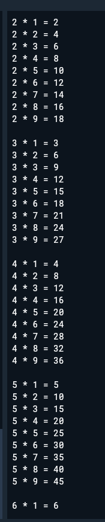
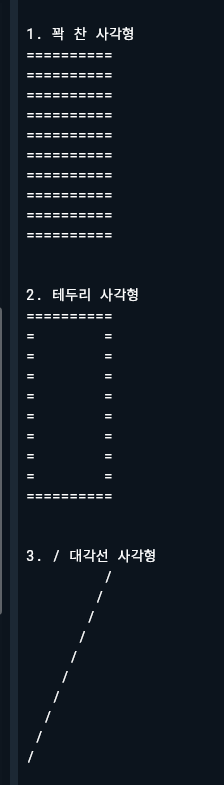
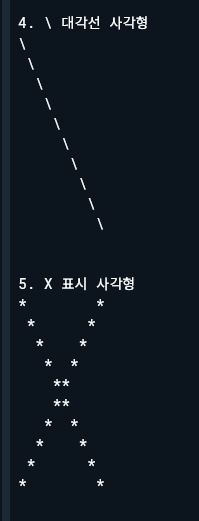
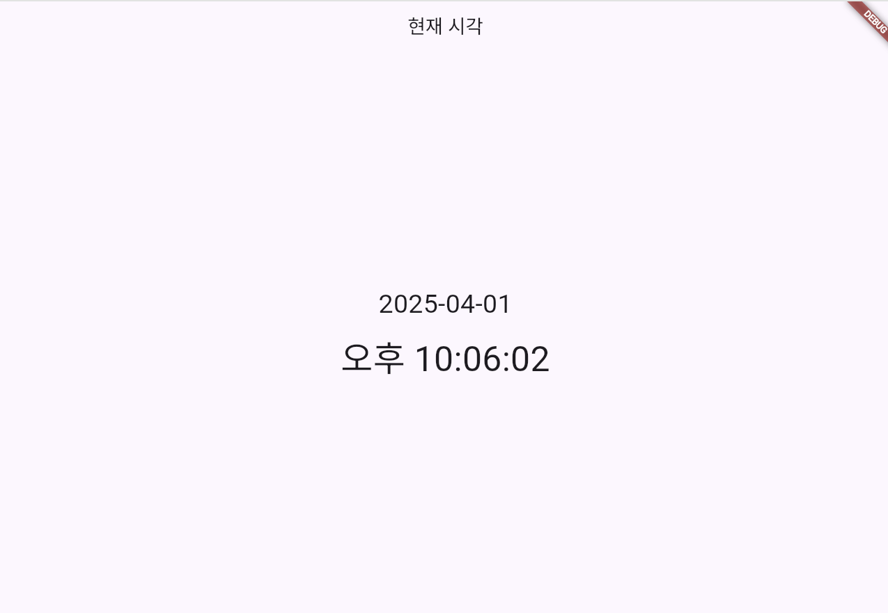
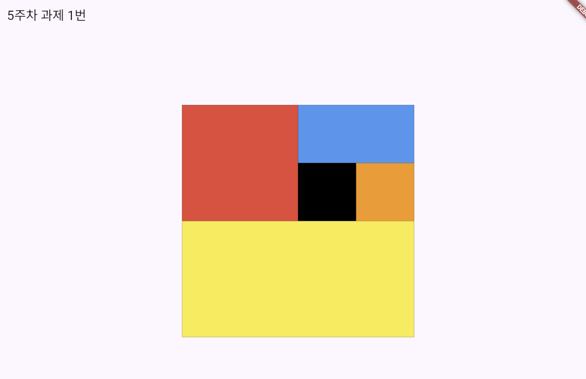
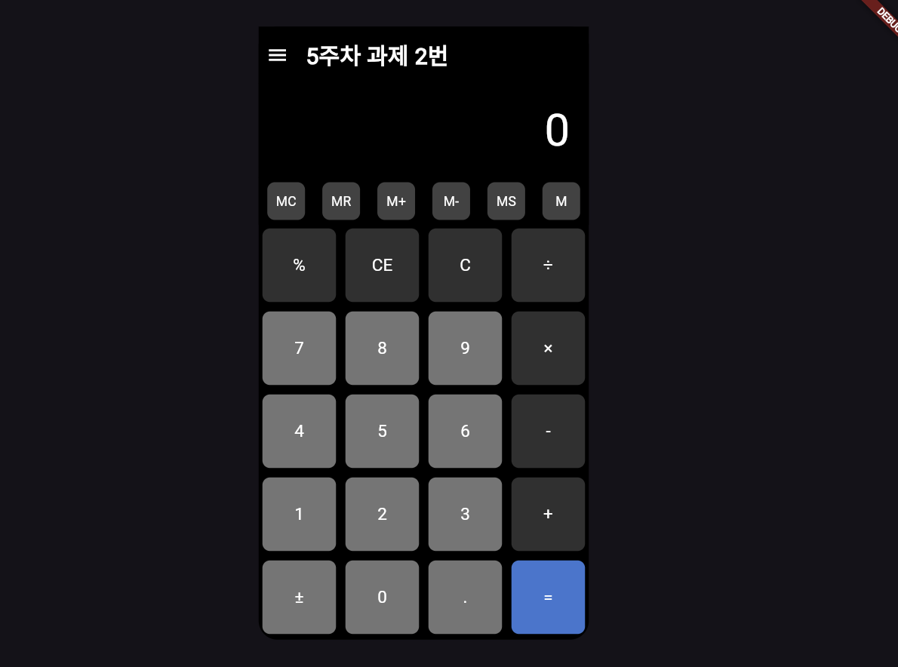

# 📊 Flutter & DartPad 실습 정리

이 저장소는 **Flutter 및 DartPad 실습 과제**를 정리한 것입니다.  
각 주차별 실습 내용을 정리하고, .dart 파일을 참고하여 실행할 수 있습니다.

---

## 📖 강의 내용 정리

### **📌 1주차 - Flutter 개발 환경 설정 및 Hello World**
- **Flutter 개발 환경 구성** (Android Studio + Flutter SDK 설치)
- **Windows 데스크탑 지원 활성화** (flutter config --enable-windows-desktop)
- **Hello World 웹 실행** (Flutter의 기본 구조 이해)

👉 **실습 코드:** hello_world.dart

🖥 **실행 결과:**  
- 캡처.PNG 확인

✨ 실행 방법

bash
   flutter run -d windows

---

### **📌 2주차 - DartPad 실습**
#### 1️⃣ **구구단 출력**
- 2단부터 9단까지 출력하는 프로그램 작성  
- 중첩 for 문을 활용하여 구현  

👉 **실습 코드:** gugudan.dart

🖥 **실행 결과:**  


---

#### 2️⃣ **사각형 출력**
- 입력받은 길이에 따라 다양한 형태의 사각형을 출력하는 프로그램 작성  
  - **꽉 찬 사각형**
  - **테두리 사각형**
  - **대각선(/, \) 및 X자 표시 사각형**  

👉 **실습 코드:** rectangle.dart

🖥 **실행 결과:**  



---

#### 3️⃣ **요일 출력**
- 저장된 **년/월/일** 값을 이용해 해당 날짜의 요일을 출력하는 프로그램 작성  

👉 **실습 코드:** day.dart

🖥 **실행 결과:**  


---

### **📌 3주차 - DartPad 실습**
#### 1️⃣ 클래스와 객체
- Person 클래스를 정의하고, 객체를 생성하여 이름과 나이를 저장
- addOneYear() 메서드를 통해 나이를 1 증가시키는 기능 포함
- 객체에 직접 접근해 값 설정 및 출력

👉 **실습 코드:** person.dart

🖥 **실행 결과:**  
[김양군, 7]

---

#### 2️⃣ 실습1을 수정 게터/세터와 캡슐화
- 클래스 필드 앞에 _를 붙여 외부 접근을 제한하는 Dart 스타일 적용
- 생성자에서 필드 초기화 (Person(this._name, this._age, this._desc))
- get, set을 사용하여 필드에 안전하게 접근하거나 수정
- 직접 접근을 막고, 메서드를 통해 값 변경 (addOneYear())

👉 **실습 코드:** person2.dart

🖥 **실행 결과:**
```
[김양군, 7, 김양군은 귀엽다!!!]
[김양군, 8, 아니다 우주최강 귀엽다!!!]
```
---

#### 3️⃣ 명명된 매개변수와 nullable 타입
- Dart에서 Person({this.name, this.age}) 형태로 명명된 매개변수 사용
- String?, int?로 nullable 타입을 지정하여 null 값 허용
- 객체 생성 시 일부 값만 전달하거나, 아예 전달하지 않는 것도 가능

👉 **실습 코드:** person_named_params.dart

🖥 **실행 결과(출력 생략됨):**
```  
p: name → null, age → null
p2: name → '김양군', age → null
p3: name → null, age → 7
p4: name → '김양군', age → 7
```
---

#### 4️⃣ 게터와 세터 활용 (사각형 위치 계산)
- `Rectangle` 클래스에서 `left`, `top`, `width`, `height`를 필드로 사용  
- `right`, `bottom`은 게터/세터로 계산하여 반환  
- 좌표계 기반으로 사각형 위치를 유연하게 계산할 수 있도록 구성

👉 **실습 코드:** rectangle_getter_setter.dart

🖥 **실행 결과:**
```  
[5, 10, 20, 25]  
[20, 25]
```
---

#### 5️⃣ 상속과 오버라이딩
- `Hero` 클래스를 상속한 `SuperHero` 클래스 생성  
- `run()` 메서드를 오버라이드하여 `super.run()` + `fly()` 메서드 실행  
- 이름 필드는 상속받아 사용 (`hero.name`)

👉 **실습 코드:** inheritance.dart

🖥 **실행 결과:**
```  
뛴다
난다!
영웅
```

---

#### 6️⃣ 추상 클래스와 다형성
- `Monster`라는 추상 클래스를 만들고, `Goblin`, `Bat`이 이를 구현  
- 각각의 `attack()` 메서드 구현 방식이 다름  
- 다형성을 활용해 `List<Monster>`에서 반복 호출 가능

👉 **실습 코드:** abstract_class.dart

🖥 **실행 결과:**
```  
고블린 어택!
할퀴기!
고블린 어택!
할퀴기!
```
---

#### 7️⃣ 열거 타입 (Enum)
- `Status`라는 열거형(enum)을 정의하여 `login`, `logout` 상태 표현  
- 숫자(0,1)가 아닌 **명시적 값**으로 상태를 표현해 **가독성 향상**  
- `switch`문을 통해 상태별 분기 처리

👉 **실습 코드:** enum_status.dart

🖥 **실행 결과:**
Status.logout 로그아웃


---

#### 8️⃣ 컬렉션, 맵, 세트 활용
- 리스트 (`List`)의 추가/삭제, 출력 기능 실습  
- 맵 (`Map`)을 이용한 key-value 저장 및 접근  
- 세트 (`Set`)를 통해 중복 제거 및 요소 추가 실습

👉 **실습 코드:** collection_map_set.dart

🖥 **실행 결과:**
```
[1, 2, 3, 4, 5, 6]
[가, 나, 다, 라, 마, 바]
[1, 2, 3, 4, 5, 6, 7]
[1, 3, 4, 5, 6, 7]
{한국: 서울, 일본: 도쿄}
서울
{1, 2, 3, 4, 5}
{1, 2, 3, 4, 5, 6}
{1, 2, 3, 4, 5, 6}
```

---

#### 9️⃣ 일급 객체와 forEach()
- Dart에서는 **함수도 변수에 담을 수 있는 일급 객체**  
- 함수를 변수에 저장했다가 실행 가능 (`fun = func_b; fun();`)  
- 리스트에 대해 일반 `for`문과 `forEach()` 문법을 모두 실습  
- 익명 함수(`(num) => print(num)`) 사용법 포함

👉 **실습 코드:** first_class_function_foreach.dart

🖥 **실행 결과:**
왼쪽! 오른쪽! 왼쪽! 오른쪽! 1 2 3 4 5

---

### **📌 4주차 - 프로젝트 구조와 앱 구조**

#### 1️⃣ 개발 환경 구성 및 프로젝트 구조 이해
- **Flutter SDK 및 Android Studio 설치**
  - Flutter SDK 다운로드: [https://docs.flutter.dev/release/archive](https://docs.flutter.dev/release/archive)
  - 설치 가이드: [Flutter 설치 (Windows/데스크탑)](https://docs.flutter.dev/get-started/install/windows/desktop)
  - SDK 업그레이드: `flutter upgrade`
  
- **Android Studio 설치**
  - 다운로드: [https://developer.android.com/studio?hl=ko](https://developer.android.com/studio?hl=ko)

- **Flutter 프로젝트 생성 및 구조 이해**
  - 기본 폴더: `lib`, `android`, `ios`, `test`, `pubspec.yaml` 등
  - 주요 진입점: `main.dart`
  - `MaterialApp`, `Scaffold`, `AppBar`, `body` 등 기본 위젯 구조 학습

- **핫 리로드(Hot Reload)**
  - 앱 상태를 유지하면서 UI 변경사항을 빠르게 반영
  - `Ctrl + S` 또는 단축키로 즉시 화면 반영 가능

👉 **실습 중심 내용:** 앱 프로젝트를 만들고 구조를 파악하며, 위젯과 코드를 수정하며 핫 리로드 실습

🖥 **실습 코드:** 없음 (환경 구성 및 구조 이해 중심)

---

#### 2️⃣ 샘플 앱 구조 분석

- **Flutter 기본 템플릿 앱(Counter App) 분석**
  - `main.dart` 파일을 중심으로 앱 실행 흐름 분석
  - `MyApp`, `MyHomePage` 클래스 구조 이해
  - `StatefulWidget`과 `setState()`의 역할 확인
  - `Scaffold`, `AppBar`, `FloatingActionButton`, `Text` 위젯 등 구성 요소 분석

- **핵심 위젯 기능 분석**
  - `setState()`를 사용한 상태 변경과 UI 반영
  - `FloatingActionButton` 클릭 시 `counter` 변수 증가
  - 위젯 트리 구조와 재렌더링 이해

- **분석 포인트**
  - 위젯의 트리 구조 이해 (자식 → 부모 → 전체 구조)
  - 상태를 어떻게 보관하고, 변경하며, UI에 반영되는지 학습
  - 코드 흐름과 각 구성 요소의 역할 분해

👉 **실습 코드:** 기본 `main.dart` 템플릿 분석  
🖥 **실행 결과:** 버튼 클릭 시 숫자가 증가하는 카운터 앱

---

### 3️⃣ 현재 시각 실시간 표시 앱 (과제)

- **AppBar(상단 제목)** 에 `"현재 시각"`이라는 텍스트 표시  
- **화면 중앙**에 현재 날짜와 시간을 실시간으로 출력 (`초`까지 포함)  
- -**1초마다 현재 시각을 갱신**  
- 시각 포맷은 `"오전/오후 시:분:초"` 형식

👉 **실습 코드:** current_time.dart  
🖥 **실행 결과:**  


---

### **📌 5주차 - Flutter 위젯 실습**

다양한 Flutter 기본 위젯을 실습하며 UI 구성 방식과 위젯의 특성을 익히는 실습을 진행함.

👉 **실습 코드:** 0407.dart

---

#### 1️⃣ **Column과 Row를 활용한 배치 실습**
- 세 개의 `Container`를 `Column` 또는 `Row`로 배치하여 정렬 방식 확인
- `margin`, `padding`, `color` 등 스타일 적용

---

#### 2️⃣ **Stack 위젯**
- 위젯들을 겹쳐서 배치할 수 있는 `Stack` 위젯 구조 학습
- `Center`와 함께 사용하여 위젯 순서대로 겹치게 표현

---

#### 3️⃣ **ListView, ListTile**
- 세로 방향으로 스크롤 가능한 리스트 뷰 구성
- `ListTile`을 활용해 아이콘과 텍스트, 액션 버튼 구성

---

#### 4️⃣ **GridView**
- `GridView.count`를 사용하여 2열 그리드 레이아웃 구성
- `Container` 위젯에 색상과 텍스트 적용

---

#### 5️⃣ **PageView**
- 페이지 단위로 좌우로 넘길 수 있는 뷰 구성 (`PageView`)
- 각 페이지에 다른 배경색 적용

---

#### 6️⃣ **BottomNavigationBar**
- 하단에 3개의 아이콘 탭을 가진 바를 구성
- `Home`, `Person`, `Notification` 등의 메뉴 구성

---

#### 7️⃣ **Alignment, Center, Padding**
- 다양한 위치 배치: `Align`, `Center`, `Padding` 위젯을 활용
- 정중앙, 우측 정렬, 여백 주기 등 배치 연습

---

#### 8️⃣ **Expanded와 Flex**
- `Column` 내에 `Expanded`를 사용하여 비율에 따라 화면 분할
- `flex` 값에 따라 높이를 조절하는 방식 실습

---

#### 9️⃣ **SizedBox**
- `SizedBox`로 고정 크기의 공간 확보 및 `Container` 배치 실습

---

#### 🔟 **Card 위젯**
- `Card` 위젯으로 그림자와 테두리를 포함한 정보 카드 구성
- `RoundedRectangleBorder`를 사용한 모서리 둥글기 설정 포함

---

#### 1️⃣1️⃣ **버튼 종류 실습**
- `ElevatedButton`, `TextButton`, `IconButton`, `FloatingActionButton` 활용
- 각 버튼의 사용 방식 및 클릭 이벤트 구성 실습

---

#### 1️⃣2️⃣ **Text 스타일링**
- `Text` 위젯의 다양한 스타일 지정
  - `fontSize`, `fontStyle`, `fontWeight`, `color`, `letterSpacing` 등

---

#### 1️⃣3️⃣ **이미지 삽입**
- `Image.network()`를 통해 URL 이미지 삽입  
- `Image.asset()`으로 로컬 이미지 사용 실습 (예: `assets/car1.jpg`)

---

#### 1️⃣4️⃣ **CircleAvatar**
- 원형 아바타 안에 아이콘을 넣어 사용자 프로필 스타일 구성

---

#### 1️⃣5️⃣ **TabBar & TabBarView**
- `AppBar`와 `TabBar`를 구성하여 탭 기반 화면 전환 구현
- `Tab(icon/text)`과 `TabBarView`에 각기 다른 색의 화면 표시

---

### 1️⃣6️⃣ 컬러 박스 UI 배치 (과제 1번)
- `Container`, `Column`, `Row`, `Expanded`를 활용해 다양한 색상 박스를 배치하는 실습  
- 복잡한 박스 구조를 `flex`로 나누어 정렬  
- 총 400x400 크기의 검은색 박스를 기준으로 내부를 색상 블록으로 구성  

👉 **실습 코드:** `lib/project5-1.dart`  
🖥 **실행 결과:**  
  

---

### 1️⃣7️⃣ 계산기 UI 배치 (과제 2번)  
- 상단바, 화면표시 영역, 메모리 버튼, 계산 버튼 등으로 구성된 계산기 레이아웃  
- `GridView.count`를 활용한 버튼 그리드 구성  
- `Container`, `Row`, `Column`, `Align`, `Padding` 등의 다양한 위젯 조합  

👉 **실습 코드:** `lib/project5-2.dart`  
🖥 **실행 결과:**  
  

🧮 **UI 구성 요약:**  
- 상단바: 메뉴 아이콘 + 제목 `"5주차 과제 2번"`  
- 숫자 표시: `0` (오른쪽 정렬)  
- 메모리 버튼: `MC`, `MR`, `M+`, `M-`, `MS`, `M`  
- 계산 버튼: `%, CE, C, ÷, 7~9, ×, … =` 등 총 20개 버튼  
  - `=` 버튼은 파란색  
  - 숫자 및 일부 연산은 밝은 회색으로  

---

### **📌 6주차 - 페이지 간 데이터 전달**

#### 1️⃣ **첫 번째 페이지에서 두 번째 페이지로 Person 객체를 전달하고, 데이터를 표시**
- 데이터를 전달받은 후 두 번째 페이지에서 결과를 반환

👉 **실습 코드:** 0414_1.txt

🖥 **실행 결과**:
첫 번째 페이지에서 버튼 클릭 시 두 번째 페이지로 데이터 전달 및 반환 확인

