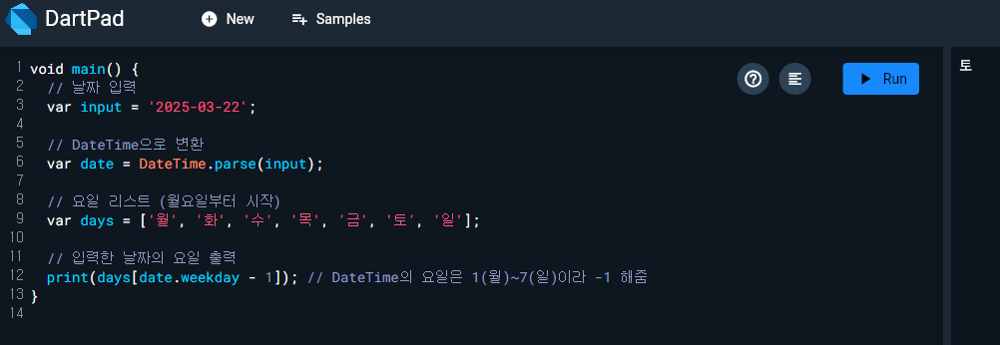

# 📊 Flutter & DartPad 실습 정리

이 저장소는 **Flutter 및 DartPad 실습 과제**를 정리한 것입니다.  
각 주차별 실습 내용을 정리하고, .dart 파일을 참고하여 실행할 수 있습니다.

---

## 📖 강의 내용 정리

### **📌 1주차 - Flutter 개발 환경 설정 및 Hello World**
- **Flutter 개발 환경 구성** (Android Studio + Flutter SDK 설치)
- **Windows 데스크탑 지원 활성화** (flutter config --enable-windows-desktop)
- **Hello World 웹 실행** (Flutter의 기본 구조 이해)

👉 **실습 코드:** hello_world.dart

🖥 **실행 결과:**  
- 캡처.PNG 확인

✨ 실행 방법

bash
   flutter run -d windows

---

### **📌 2주차 - DartPad 실습**
#### 1️⃣ **구구단 출력**
- 2단부터 9단까지 출력하는 프로그램 작성  
- 중첩 for 문을 활용하여 구현  

👉 **실습 코드:** gugudan.dart

🖥 **실행 결과:**  

---

#### 2️⃣ **사각형 출력**
- 입력받은 길이에 따라 다양한 형태의 사각형을 출력하는 프로그램 작성  
  - **꽉 찬 사각형**
  - **테두리 사각형**
  - **대각선(/, \) 및 X자 표시 사각형**  

👉 **실습 코드:** rectangle.dart

🖥 **실행 결과:**  

---

#### 3️⃣ **요일 출력**
- 저장된 **년/월/일** 값을 이용해 해당 날짜의 요일을 출력하는 프로그램 작성  

👉 **실습 코드:** day.dart

🖥 **실행 결과:**  

---

### **📌 3주차 - DartPad 실습**
#### 1️⃣ 클래스와 객체
- Person 클래스를 정의하고, 객체를 생성하여 이름과 나이를 저장
- addOneYear() 메서드를 통해 나이를 1 증가시키는 기능 포함
- 객체에 직접 접근해 값 설정 및 출력

👉 **실습 코드:** person.dart

🖥 **실행 결과:**  
[김양군, 7]

---

#### 2️⃣ 실습1을 수정 게터/세터와 캡슐화
- 클래스 필드 앞에 _를 붙여 외부 접근을 제한하는 Dart 스타일 적용
- 생성자에서 필드 초기화 (Person(this._name, this._age, this._desc))
- get, set을 사용하여 필드에 안전하게 접근하거나 수정
- 직접 접근을 막고, 메서드를 통해 값 변경 (addOneYear())

👉 **실습 코드:** person2.dart

🖥 **실행 결과:**  
[김양군, 7, 김양군은 귀엽다!!!]
[김양군, 8, 아니다 우주최강 귀엽다!!!]

---

#### 3️⃣ 명명된 매개변수와 nullable 타입
- Dart에서 Person({this.name, this.age}) 형태로 명명된 매개변수 사용
- String?, int?로 nullable 타입을 지정하여 null 값 허용
- 객체 생성 시 일부 값만 전달하거나, 아예 전달하지 않는 것도 가능

👉 **실습 코드:** person_named_params.dart

🖥 **실행 결과(출력 생략됨):**  
p: name → null, age → null
p2: name → '김양군', age → null
p3: name → null, age → 7
p4: name → '김양군', age → 7

---

#### 4️⃣ 게터와 세터 활용 (사각형 위치 계산)
- `Rectangle` 클래스에서 `left`, `top`, `width`, `height`를 필드로 사용  
- `right`, `bottom`은 게터/세터로 계산하여 반환  
- 좌표계 기반으로 사각형 위치를 유연하게 계산할 수 있도록 구성

👉 **실습 코드:** rectangle_getter_setter.dart

🖥 **실행 결과:**  
[5, 10, 20, 25]  
[20, 25]

---

#### 5️⃣ 상속과 오버라이딩
- `Hero` 클래스를 상속한 `SuperHero` 클래스 생성  
- `run()` 메서드를 오버라이드하여 `super.run()` + `fly()` 메서드 실행  
- 이름 필드는 상속받아 사용 (`hero.name`)

👉 **실습 코드:** inheritance.dart

🖥 **실행 결과:**  
뛴다
난다!
영웅

---

#### 6️⃣ 추상 클래스와 다형성
- `Monster`라는 추상 클래스를 만들고, `Goblin`, `Bat`이 이를 구현  
- 각각의 `attack()` 메서드 구현 방식이 다름  
- 다형성을 활용해 `List<Monster>`에서 반복 호출 가능

👉 **실습 코드:** abstract_class.dart

🖥 **실행 결과:**  
고블린 어택!
할퀴기!
고블린 어택!
할퀴기!

---
